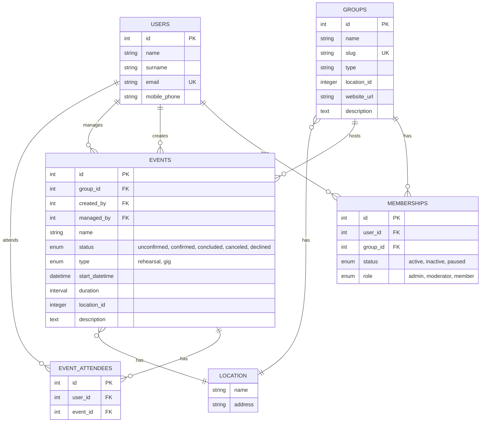

# What is Chorifico?

Chorifico is an online place for managing main chores of your choir. 😊

## What chores?

Chorifico is focused on managing essential and fundamental parts of your choir:

* Members
* Events
---
* Notifications
* Songbook
* Polls (quick and easy feedback)
* Subscriptions (membership fees)

### LATER

* Comments / Notes
* File / Attachments
* Documents / Articles / Posts

## And what about...

### Chorifico name? Where does it come from?

TODO: (chorus + ifico)

# Roadmap

In order to launch a 1.0 version of the web app, it needs to have:

## Web framework

* Plain and simple Rails web app with mobile first interface
  * ERB + partials + layout
  * DaisyUI

### LATER

* Snappy Rails PWA with push notifications via Hotwire

### MAYBE?

* ViewComponents
* Hotwire Native mobile app
* Integrated PM or Chat?!?

## Groups

* Basic data:
  * Name
  * username / slug / ?!?
  * Type
  * Location
  * website URL
  * Description

## Users

* User can **LOGIN** to their account with:
  * Email via magic link
* Users have their **PROFILE** with basic data:
  * Name
  * Surname
  * Email address
  * Mobile phone number

### LATER

* User can **LOGIN** to their account with:
  * Google account (?)
  * Passkey

### MAYBE?

* User / Profile / Account / Identity

## Memberships

* User <-> Group association
* Fields:
  * Start date
  * End date
  * Status: Active, Paused, Inactive
  * Role(s)

### LATER

* Membership history:
  * Start date
  * Status
* Business logic about update, create, destroy...
* Dependencies -- DO NOT DESTROY!

## Roles

* Group owner
* Events & Polls admin
* Treasury admin
* Member (default)

### LATER

* Group admin
* Songbook admin
* Polls admin

## Events

* Event contains basic data:
  * Name
  * Status: unconfirmed, confirmed, concluded, canceled, declined
  * Type: Rehearsal, Gig (Performance/Concert) - or just do it as tagging/categorization?
  * Start date and time
  * End date and time
  * Location
  * Description
  * created_by (event admin)
  * managed_by (member)
  * Attendees via association
* Only (event) admin can create events
* Users are invited via email to RSVP their attendance

### LATER

* Deadline for RSVP
* Reccuring events
* Attachments or links to other entities e.g. Songs, File uploads?
* Belong to season (either whole year or some specifit date range)
* Track RSVP (and other?) changes...

### MAYBE?

* iCalendar one-way sync
* Status workflow (rules)

## Songbook

* Song should have following basic fields:
  * Title
  * Lyrics
  * Notes

### LATER

* Extra fields:
  * Duration
  * Key
  * Author
  * Arrangement
* Attachments

## Polls

### LATER

* Polls about:
  * Upcoming events
  * All other kinds of stuff

## Treasury

## LATER

* Membership fee aka Subscriptions

## Later

* Translations aka il8n
* Comments
* Seasons
* Reports
  * For ZAMP!!!
* Attachments
* Dashboard

## Maybe?

* Tasks

# Technical details

## Tech stack

* Ruby on Rails

## ERD

